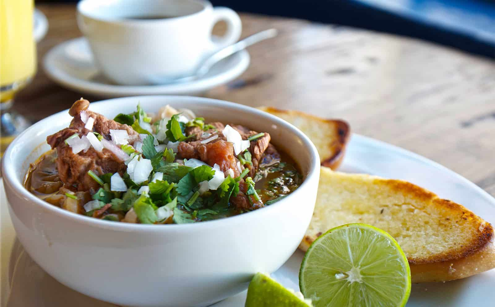

# GALLINA PINTA SONORENSE

###### (Para 6 a 8 personas)

| Ingredientes |
|:------------:|
| 4lts. de agua |
| 1 cola de res en trozos de 5 cm. aprox. |
|1 kg. de pecho de res en trozos o chambarete|
| (chamorro) en 3 cm. aprox.|
|1/2 kg. de frijol pinto|
|1/2 kg. de nixtamal o maíz precocido*|
|1cabeza de ajo|
|1 cebolla blanca grande|
|1 mazo de cilantro|
|1 chile verde sin semillas y sin cola|
|sal al gusto (se agrega después de que revienteel maíz)|

