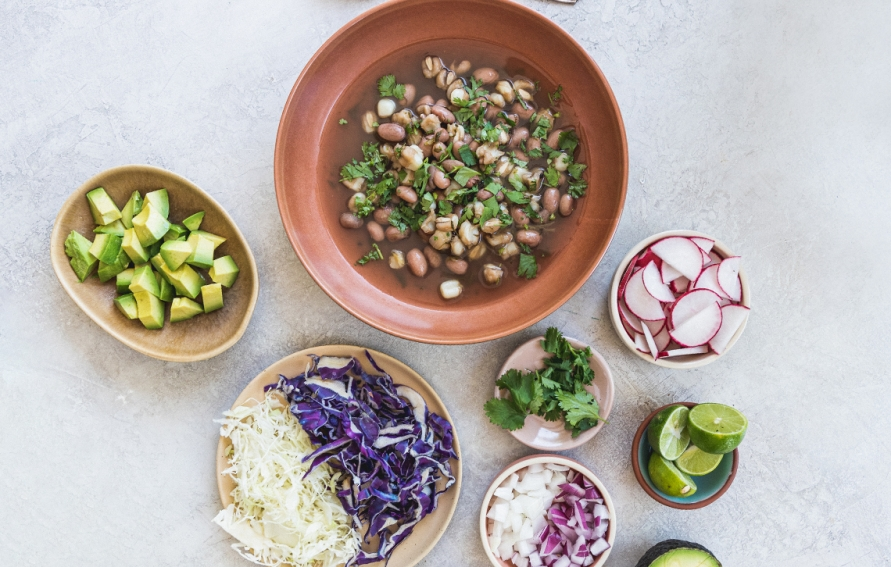

<div align="center">

# **GALLINA PINTA SONORENSE**

</div>

<p align ="center">

</p>

<div align ="center">

| Tabla        |Nutricional |
| :----------: | :--------: |
|Energía (Kcal)| 380 Kcal|
|Proteína (g)  | 33g|
|Grasa (g)     | 14g|
|Carbohidratos (g)| 39g|
|Fibra (g)     | 7.5g| 

</div>


```
Ingredientes

* 4 lts. de agua 
* 1/2 kg cola de res en trozos de 5 cm. aprox.
* 1 kg. de pecho de res en trozos o chambarete * chamorro) en 3 cm. aprox.
* 1/2 kg. de frijol pinto
* 1/2 kg. de nixtamal o maíz precocido*
* 1 cabeza de ajo
* 1 cebolla blanca grande
* 1 mazo de cilantro
* 1 chile verde sin semillas y sin cola
* Sal al gusto (se agrega después de que reviente el maíz)

```

```

 PARA ACOMPAÑAR

•	 1/2 taza Cebolla , picada.
•	 1/2 taza Hojas de Cilantro , finamente picado.
•	 2 Chiles serranos , finamente picados o Chile Chiltepín al gusto.

```

<div align ="center">

**¿Porque se llama gallina pinta?**

</div>

<div align ="left">

Su nombre se debe a la apariencia que forman los granos blancos del maiz al mezclarse con el tono café del frijol.
Se consume principalmente en el norte de Sonora a la hora del almuerzo o bien como plato principal del mediodia.

</div>

<div align ="left">

**PROCEDIMIENTO:**

1.- En una olla grande, se ponen a fuego lento los cuatro litros de agua y la carne. Cuando la carne suelta espuma, esta se retira con una cuchara hasta que el agua quede clara, se agrega el frijol (crudo) y el nixtamal (crudo)* bien lavado, la cebolla, el ajo y el chile verde (no se agrega sal porque si se hace no revienta el grano).

2.- Se deja cocer por espacio de hora y media o hasta que la carne se ponga suave y el nixtamal haya reventado.

3.- Se agrega el cilantro en mazo, se deja hervir durante 10 minutos. Se agrega sal al gusto y ya se puede servir.

</div>

<div align ="left">

**TIP 1:**
La Gallina Pinta es más sabrosa al día siguiente (recalentada).
Una modalidad actual es sacar el mazo de cilantro, la cebolla, el chile y el ajo junto
con una cucharada de caldo, licuarlo y verterlo nuevamente al caldo a través de un
colador. Esto acentúa el sabor y da al caldo el carácter de sopa como si hubiera
sido cocinado a fuego lento desde el día anterior.
*Si se usa nixtamal del que se expende como maíz precocido en tiendas de
autoservicio, el proceso se modifica poniendo el maíz, media hora después que el
frijol y se deja cocer una hora.

**TIP 2:**
Aquí este puchero se sirve con cebolla picada, cilantro y si quieres agregarle algo
picosito, polvo de chile chiltepín; diferente a todos los acompañamientos que
puede llevar el “pozole pobre” (también conocido de esta manera) éste se come
con dos panes con mantequilla.

</div>

<p align ="center">

</p>

<div align ="center">

#### Te compartimos un video de Cocinando con Alba Janeth
[Video](https://www.youtube.com/watch?v=Rk3xEa-cAC8)

</div>
